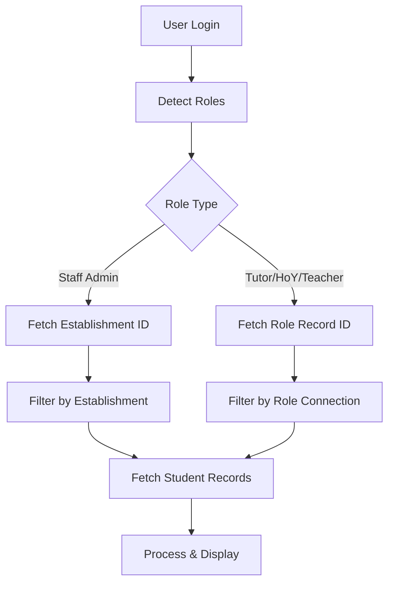

# Student Results Viewer - Project Handover Document

## Project Overview
**Date**: January 2025  
**Developer**: 4Sight Education Ltd  
**Application**: Vue.js-based VESPA Student Results Viewer for Knack  
**Repository**: https://github.com/4Sighteducation/student-results-viewer

## Project Aims
Create a comprehensive, role-based student results viewing system that:
1. **Dynamically displays VESPA scores** based on logged-in staff member's role
2. **Supports multiple staff roles** with appropriate data filtering
3. **Provides beautiful, responsive tables** with RAG color coding
4. **Handles large datasets** (20,000+ records) with pagination
5. **Offers advanced filtering and sorting** capabilities
6. **Enables CSV export** of filtered results

## Technical Architecture

### Knack Integration
- **Scene**: `scene_1270`
- **View**: `view_3214` (Rich Text view)
- **Integration Method**: Knack App Loader (`WorkingAppLoader1.0_12_08_25.js`)
- **Files**: 
  - Production: `studentResultsViewer1a.js` and `studentResultsViewer1a.css`
  - CDN: `https://cdn.jsdelivr.net/gh/4Sighteducation/student-results-viewer@main/dist/`

### Key Knack Objects & Fields

#### Object_10 (VESPA Results)
**Connection Fields:**
- `field_133`: Establishment (Links to Object_2)
- `field_439`: Staff Admin connection (Links to Object_5)
- `field_145`: Tutor connection (Links to Object_7)
- `field_429`: Head of Year connection (Links to Object_18)
- `field_2191`: Subject Teacher connection (Links to Object_78)

**Student Information:**
- `field_197`: Student Email
- `field_187`: Student Name
- `field_223`: Group
- `field_144`: Year Group
- `field_782`: Faculty
- `field_146`: Cycle

**VESPA Scores:**
```
Cycle 1: field_155-160 (V, E, S, P, A, Overall)
Cycle 2: field_161-166 (V, E, S, P, A, Overall)
Cycle 3: field_167-172 (V, E, S, P, A, Overall)
```

#### Staff Objects
- **Object_5** (Staff Admin): Email field = `field_86`
- **Object_7** (Tutor): Email field = `field_96`
- **Object_18** (Head of Year): Email field = `field_417`
- **Object_78** (Subject Teacher): Email field = `field_1879`

## Current Implementation Status

### ✅ Completed Features
1. **Role Detection & Mapping**
   - Correctly maps Knack object IDs to role names
   - Supports: Staff Admin, Tutor, Head of Year, Subject Teacher
   - Multi-role support with combined student views

2. **Data Structure**
   - Handles ONE record per student (all cycles in same record)
   - Processes all three cycles from single record
   - Calculates trends between cycles

3. **Filtering System**
   - Tutor filtering working (uses record ID matching)
   - Multi-page pagination for large datasets
   - Client-side filtering by Year Group, Faculty, Group
   - Search functionality

4. **UI Features**
   - RAG color coding (Red: 1-3, Amber: 4-5, Light Green: 6-8, Dark Green: 9-10)
   - Trend indicators (↑↓↔)
   - Sortable columns
   - CSV export
   - Responsive design

### ⚠️ Known Issues

1. **Staff Admin Filtering**
   - Currently not filtering by establishment correctly
   - Fetches first 1000 records instead of establishment-specific
   - Need to debug establishment field structure in Object_5

2. **Large Dataset Handling**
   - API pagination works but needs optimization
   - Consider implementing virtual scrolling for performance

## Data Flow



## Current Debug Status

### Working:
- ✅ Tutor role shows only their ~15 connected students
- ✅ Score fields display correctly
- ✅ RAG colors apply properly
- ✅ Trends calculate between cycles

### Not Working:
- ❌ Staff Admin sees 1000 random records instead of establishment-filtered
- ❌ Establishment ID extraction from Staff Admin record needs fixing

## Next Steps

### Immediate Fixes Required
1. **Fix Staff Admin Establishment Filtering**
   ```javascript
   // Need to determine correct field structure for establishment in Object_5
   // Current attempt: field_133_raw?.[0]?.id
   // May need: field_133 or different structure
   ```

2. **Run Debug Script** (provided in conversation):
   - Check Staff Admin record structure
   - Verify establishment field format
   - Test establishment-based filtering

### Future Enhancements
1. **Performance Optimization**
   - Implement virtual scrolling for tables > 500 rows
   - Add loading progress indicator for multi-page fetches
   - Cache role/establishment lookups

2. **Additional Features**
   - Individual student progress charts (hover)
   - Group analytics modal
   - Comparative analysis tools
   - Print-friendly view
   - Save filter preferences

3. **Testing Required**
   - Test with Head of Year role
   - Test with Subject Teacher role
   - Test with multi-role users
   - Test with establishments > 1000 students
   - Mobile responsiveness testing

## Deployment Instructions

### Update Code
```bash
cd STUDENT-RESULTS-VIEWER
git add .
git commit -m "Your changes"
git push origin main
```

### CDN Cache
- Files cached via jsdelivr
- Force refresh: append `?v=VERSION` to URLs
- Or wait ~10 minutes for cache refresh

### Testing Checklist
- [ ] Test as Staff Admin (should see all establishment students)
- [ ] Test as Tutor (should see only tutees)
- [ ] Test as Head of Year
- [ ] Test as Subject Teacher
- [ ] Test multi-role user
- [ ] Verify RAG colors
- [ ] Test CSV export
- [ ] Check mobile view

## Support Files

### Configuration Files
- `src/config/fieldMappings.js` - Central field configuration
- `src/styles/main.css` - Styling
- `package.json` - Dependencies

### Documentation
- `README.md` - User documentation
- `docs/API.md` - API documentation
- `docs/DEPLOYMENT.md` - Deployment guide

## Contact & Support

For issues or questions:
- Check browser console for detailed error logs
- Debug mode is currently ON (`debugMode: true`)
- All API calls are logged with `[Student Results Viewer]` prefix

## Critical Notes

⚠️ **IMPORTANT**: The app currently loads up to 10 pages (10,000 records) maximum to prevent timeouts. For larger establishments, consider implementing server-side filtering or a different data strategy.

⚠️ **FIELD CONFLICTS**: Original field mappings had conflicts (field_166 used twice). These have been corrected but verify all mappings are accurate.

## Summary

The Student Results Viewer is ~85% complete. The main functionality works for Tutors but needs the Staff Admin establishment filtering fixed. Once that's resolved, the app will be fully functional for all roles. The codebase is well-structured with clear separation of concerns and comprehensive error handling.
